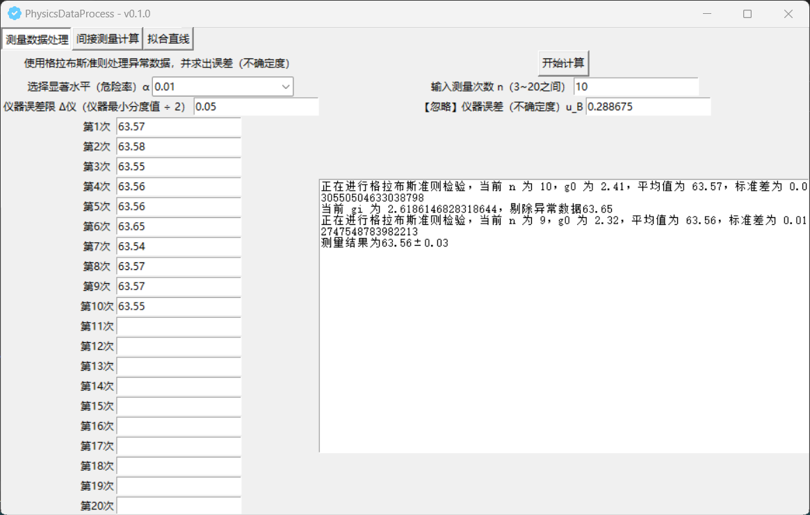
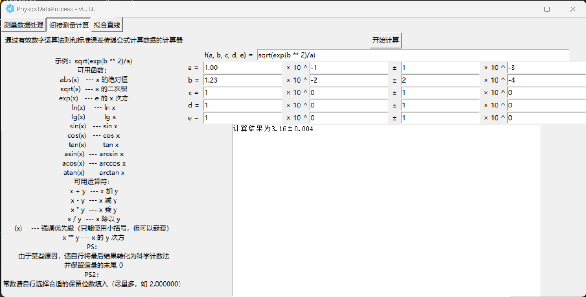
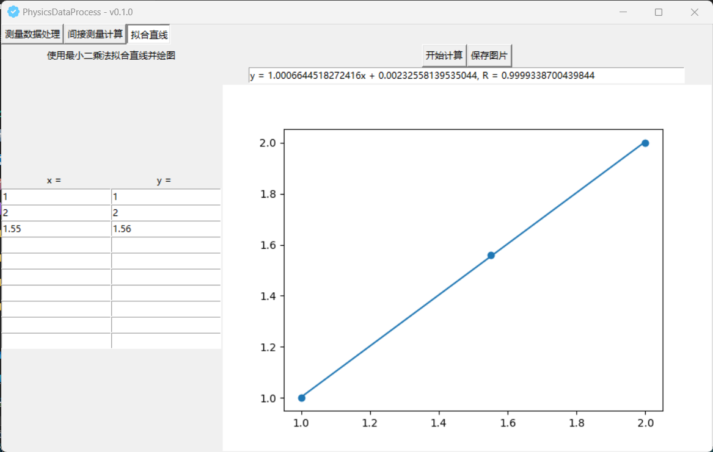

# PhysicsDataProcess

这是一个主要用于物理实验计算的计算器。

写这个其实一开始只准备方便自己处理数据，后来想到不如加个图形化发布了算了，就诞生了这个程序。  

图形化界面使用 Python 的 Tkinter 原生框架实现，为了赶时间开发出来，采取了摆烂到底的做法，没有怎么优化布局。  
绘图则采用了 matpylotlib.pyplot 原生接口，同样坚持摆烂到底的原则，没做任何优化。  
求导则使用 pytorch 的自动求导，简单，便于摆烂。   
Python 代码打包为 exe 则使用 pyinstaller 自动打包。  
图表设计版权属于 Luogu 所有，如有侵权，请联系删除。 

总结：以后可能会加入一些其他的功能比如画更复杂的图之类的，如果有什么 bug 或者错误也欢迎通过各种方式提出。
